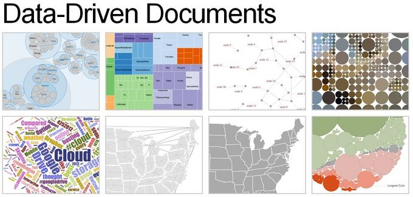
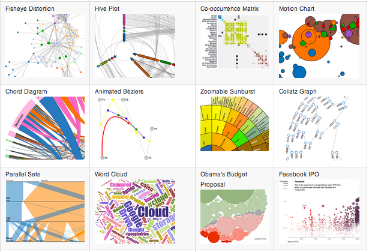

% Headers
title: 明日から使えるD3.js
author: @tenten0213
cover: d3.jpg
% Slides Start

# D3.jsとは？
<link type="text/css" rel="stylesheet" href="../syntaxhighlighter_2.1.382/styles/shCore.css"/>
<link type="text/css" rel="stylesheet" href="../syntaxhighlighter_2.1.382/styles/shThemeMidnight.css"/>

* [http://d3js.org/](http://d3js.org/)

# 特徴
* 修正BSDライセンス(商用利用可能)
* 豊富なサンプル、ドキュメント
* インタラクティブなグラフや、アニメーションを付けたい場合にオススメ
* jQueryライクなセレクタ
  * jQueryを使い慣れている人には取っ付き易い

# 前提知識
* HTML5
	* DOM構造
* CSS3
* JavaScript
	* jQuery
* SVG  
まったく知らないという状態じゃなければ大丈夫！だと思います...

# Galleryを見てみよう！
* https://github.com/mbostock/d3/wiki/Gallery

# D3.jsの基礎
Galleryにあるサンプルは綺麗で参考にはなるのですが、  
複雑なのでまずは基礎から見ていきましょう。

# これから説明すること
* セレクション
* 要素の追加
* メソッドチェイン
* Styleの設定 
* append,remove 
* データバインディング 
* update,enter,exit 
* 要素の描画 

# これから説明すること
* transition 
* イベント設定 
* scale 
* axis 
* D3.jsのレイアウト 
* 基本的なグラフの作成 
* Demo(説明もするし、3-5分) 
* CSVからグラフ描画 

# 今回は説明しないこと

# D3.jsを利用するには
* [D3.js](http://d3js.org/)のサイトからzipファイルを取得
* [Github](https://github.com/mbostock/d3) から取得
* 以下を記述

<pre class="brush: html">
  
</pre>

# セレクション
* D3はjQueryの様なセレクタを提供している
* 操作対象の任意のノードセットをセレクションと呼びます
* 通常のDOM APIを用いた操作と異なり容易

# DOM APIだと

<pre class="brush: js">
var paragraphs = document.getElementsByTagName("p");
for (var i = 0; i < paragraphs.length; i++) {
   var paragraph = paragraphs.item(i);
      paragraph.style.setProperty("color", "white", null);
      }
</pre>
[http://d3js.org/](http://d3js.org/)

# D3セレクタだと

<pre class="brush: js">
d3.select("#TEXT1").style("background-color", "white");
</pre>
[http://d3js.org/](http://d3js.org/)

楽ちんですね！

# 要素の追加

# メソッドチェイン

# Styleの設定

# append,remove

# データバインディング

http://shimz.me/blog/d3-js/2619

# update,enter,exit

# 要素の描画

# transition

# イベント設定

# scale

# axis

# D3.jsのレイアウト

# 基本的なグラフの作成

# Demo(説明もするし、3-5分)

# CSVからグラフ描画

# 参考(公式)
* [D3.js](http://d3js.org/)
* [公式チュートリアル](https://github.com/mbostock/d3/wiki/Tutorials)
* [Gallery](https://github.com/mbostock/d3/wiki/Gallery)

# 日本語ドキュメント
* [D3.js(日本語)](http://ja.d3js.node.ws/)
* [D3チュートリアル スコット・マレイ](http://ja.d3js.info/alignedleft/tutorials/d3/)
* [Daily D3](http://daily.d3js.info/)
* [ドットインストール-D3.js入門](http://dotinstall.com/lessons/basic_d3js)

# 参考（あとで消す）
* [svg要素の基本的な使い方まとめ](http://www.h2.dion.ne.jp/~defghi/svgMemo/svgMemo_20.htm)
* [d3.js - 三つの小円](http://ja.d3js.node.ws/document/tutorial/circle.html)
* [コンソールでselect,data,enterメソッドを理解する](http://shimz.me/blog/d3-js/2619)
* [D3.jsとjQueryのセレクションメソッドの違い](http://shimz.me/blog/d3-js/2963)
* [D3 - セレクションの仕組み](http://ja.d3js.info/mike/selection/)
* [jsdo.it](http://jsdo.it/tag/d3.js)

# スコット・マレイのチュートリアル目次
* 要素の追加
* メソッドのチェイン
* データのバインディング
* データの使い方
* DIV 要素の描画
* data() の力

# スコット・マレイのチュートリアル目次
* SVG の基本
* SVG の描画
* データ型
* 棒グラフの作成
* 散布図の作成
* スケール
* 軸

# ドットインストール
* styleを設定してみよう
* append､removeを使ってみよう
* dataを使ってみよう
* update､enter､exitを理解しよう (1)
* update､enter､exitを理解しよう (2)
* SVG領域を設定してみよう
* データを使ってcircleを描画しよう

# ドットインストール
* transitionを使ってみよう
* eachを使ってみよう
* onでイベントを設定しよう
* 横棒グラフを描画してみよう
* scaleを使ってみよう
* axisを使ってみよう (1)
* axisを使ってみよう (2)

# svg要素の基本的な使い方まとめ
* svgによる図形の描画
* scaleオブジェクトによる値の変換
* attrメソッドの動作
* 基本的なグラフ作成
* D3.jsのレイアウト

# 【D3.js】超基本！ コンソールでselect,data,enterメソッドを理解する。
* データバインディング
* select
* data
* enter
